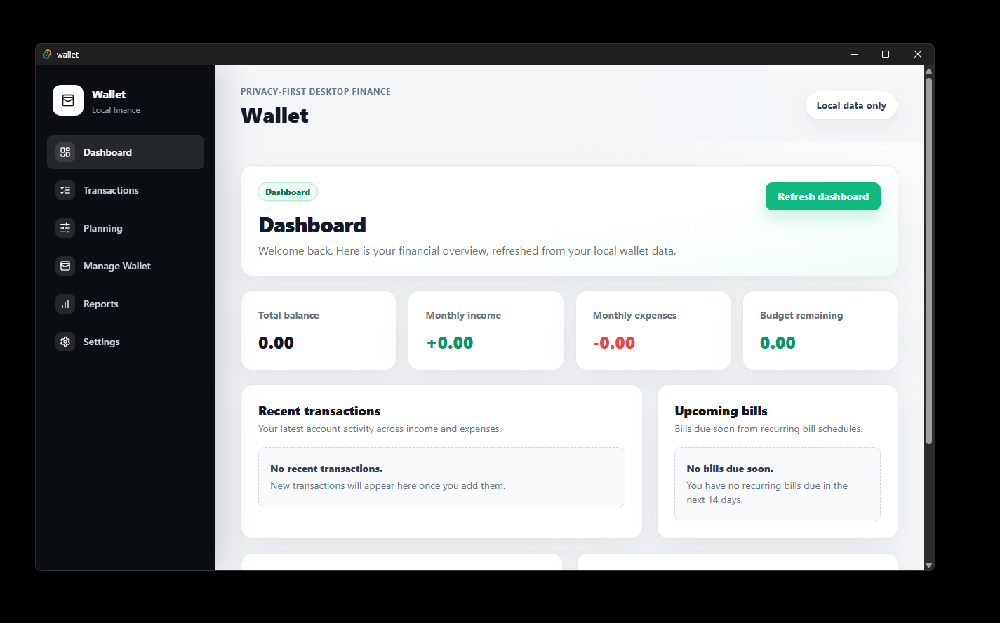
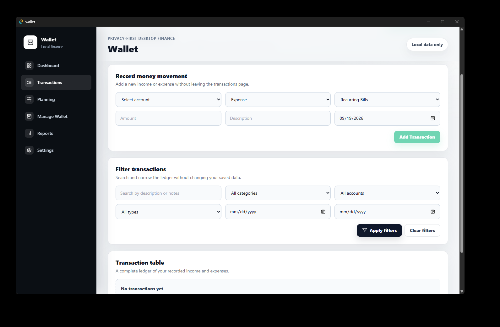
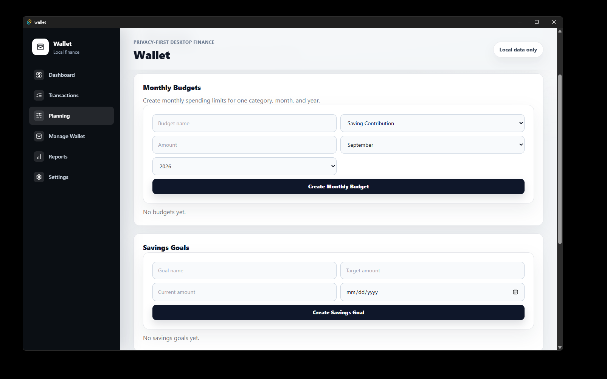

# Wallet

> A local-first desktop app for managing your personal finances — **Private by design**.

[](https://github.com/SnoWed-29/wallet-privacy/actions/workflows/ci.yml)
[](https://github.com/SnoWed-29/wallet-privacy/releases)

Wallet helps you track accounts, transactions, budgets, recurring bills, and savings goals without requiring an account, bank connection, or cloud service. Your finance data stays under your control on your device.

## Features

- Create and manage accounts, income and expense categories, and transactions.
- See balances, monthly income and spending, recent activity, budgets, upcoming bills, and savings goals in one dashboard.
- Plan with monthly budgets, recurring bills, and savings-goal contributions.
- Explore reports for trends, categories, accounts, budgets, bills, and savings goals.
- Import, export, back up, and restore Wallet data.
- Protect local data at rest with a password-based encrypted wallet.
- Work entirely offline — no mandatory sign-in, analytics, bank integration, or cloud sync.

## Screenshots

Here are a few views of Wallet in action.

| Dashboard | Transactions |
| --- | --- |
|  |  |

### Planning



## Download

Download the latest desktop installer from the [GitHub Releases page](https://github.com/SnoWed-29/wallet-privacy/releases/latest).

- **Windows:** download and run the Windows installer attached to the release.
- **macOS (Apple Silicon):** download the `.dmg` built for `aarch64-apple-darwin` (M1, M2, M3, and newer Macs).
- **macOS (Intel):** download the `.dmg` built for `x86_64-apple-darwin`.

Current macOS builds are unsigned and not notarized, so Gatekeeper may show a warning on first launch. Linux installers are not currently published.

## Tech stack

| Layer | Technologies |
| --- | --- |
| Desktop application | [Tauri 2](https://v2.tauri.app/) |
| User interface | [React 19](https://react.dev/), [TypeScript](https://www.typescriptlang.org/), [React Router](https://reactrouter.com/), [Vite](https://vite.dev/), [Tailwind CSS](https://tailwindcss.com/) |
| Backend | [Rust](https://www.rust-lang.org/), Tauri commands, domain services, and repositories |
| Local data | SQLite through [SQLx](https://github.com/launchbadge/sqlx) |
| Local-data protection | Argon2id password derivation and ChaCha20-Poly1305 authenticated encryption |
| Testing | Vitest, React Testing Library, Rust tests, and WebdriverIO with `tauri-driver` |
| Automation | GitHub Actions for CI, CodeQL, and desktop releases |

## Run locally

### Prerequisites

Install the following before starting:

- [Node.js 22](https://nodejs.org/) or newer
- [Rust](https://www.rust-lang.org/tools/install) (stable toolchain)
- Platform prerequisites required by [Tauri](https://v2.tauri.app/start/prerequisites/)

On macOS, also install the Xcode Command Line Tools:

```bash
xcode-select --install
```

### Setup

Clone the repository and install the JavaScript dependencies:

```bash
git clone https://github.com/SnoWed-29/wallet-privacy.git
cd wallet-privacy
npm install
```

Start the desktop app in development mode:

```bash
npm run tauri dev
```

On Windows PowerShell, use `npm.cmd` if your execution policy prevents the `npm` command from running:

```powershell
npm.cmd run tauri dev
```

The development app starts maximized and loads the Vite frontend from `http://localhost:1420`.

## Start modifying the project

The main areas of the codebase are:

```text
src/                     React application and feature pages
src/components/          Shared UI components and layouts
src/features/            Dashboard, transactions, planning, reports, settings, and onboarding
src/hooks/useWalletApp.ts Frontend wallet workflow and Tauri command calls
src-tauri/src/           Rust commands, services, domain logic, and repositories
src-tauri/migrations/    SQLite migrations
docs/                    Architecture, security, data portability, and product documentation
e2e/                     Desktop end-to-end tests
```

For changes to the interface, begin in `src/features` and reuse the shared components in `src/components/ui`. For finance rules or persistent-data changes, follow the backend flow:

```text
React → Tauri command → Rust service → repository → SQLite
```

Add schema changes through a new SQLx migration in `src-tauri/migrations`; the frontend should not access SQLite or execute SQL directly.

## Useful commands

```bash
# Frontend development only (without the Tauri desktop shell)
npm run dev

# Type-check, test, and build the frontend
npm run typecheck
npm run test
npm run test:coverage
npm run build

# Run Rust formatting, linting, and tests
cargo fmt --manifest-path src-tauri/Cargo.toml -- --check
cargo clippy --manifest-path src-tauri/Cargo.toml --all-targets --all-features -- -D warnings
cargo test --manifest-path src-tauri/Cargo.toml

# Build the desktop installers
npm run tauri build

# Run desktop end-to-end tests (requires tauri-driver)
cargo install tauri-driver
npm run test:e2e
```

## Data and privacy

Wallet is designed to run without a mandatory online account or cloud backend. In production, its encrypted wallet file is stored in the operating system's app-data directory. While the wallet is unlocked, decrypted data is kept in the app process so it can be used by SQLite and the interface.

You can create encrypted backups and also export plain JSON for portability. Keep plain exports somewhere safe: they are intentionally not encrypted. See the [security notes](docs/security-encryption.md) and [data portability documentation](docs/data-portability.md) for implementation details.

## Contributing

Contributions, bug reports, and ideas are welcome. Please open an [issue](https://github.com/SnoWed-29/wallet-privacy/issues) before substantial work so the approach can be discussed, then open a focused pull request with relevant tests.

Before submitting a pull request, run the checks that apply to your change—at minimum `npm run typecheck`, `npm run test`, and `npm run build` for frontend work.

## Releases

Pushing a version tag such as `v0.2.1` starts the release workflow. It runs checks, builds Windows and macOS artifacts, and creates a draft GitHub Release for review. See [the release workflow](.github/workflows/release.yml) for the exact process.

## License

A license file has not yet been added to this repository. Until one is published, all rights are reserved by the project owner.
